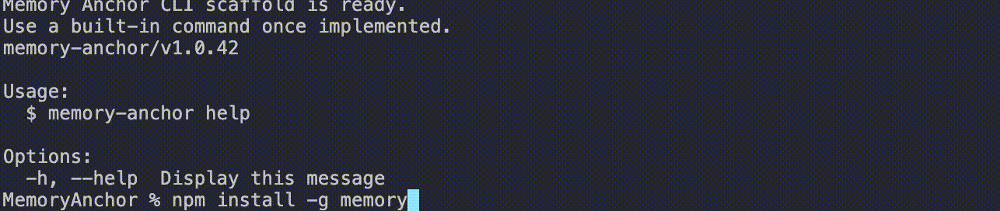

# Memory Anchor

Memory Anchor is a local, file-based memory layer for coding agents. It turns a repository into a compact set of architecture charts, keeps durable project rules and decisions beside the code, and refreshes that memory from Git changes as agents work.


## Quick start

```bash
npm install -g memory-anchor

cd /path/to/your/project
anchor init
anchor status
```

`anchor init` builds the initial partitioned chart and configures every supported agent. Use an `init-<agent>` command when only one integration is needed.

## What Memory Anchor stores

Memory Anchor keeps its generated state under `.memoryanchor/`:

| Path | Purpose |
| --- | --- |
| `.memoryanchor/index.md` | Small repository-level index that routes an agent to the closest chart partition. |
| `.memoryanchor/chart/**/chart.md` | Directory-scoped architecture charts containing a dependency skeleton, extracted symbols, and in-chart reverse symbol dependencies. |
| `.memoryanchor/dirTree.json` | Internal directory topology, aggregate character counts, and split state used by incremental updates. |
| `.memoryanchor/ballast.md` | Durable default and repository-specific rules. |
| `.memoryanchor/manifest.md` | Module status, known issues, dependencies, and architectural decisions. |
| `AGENTS.md` | Workflow instructions telling agents how to use the index, charts, ballast, and manifest. |

Charts are generated output and should not be edited manually. Ballast and manifest are intentionally readable project memory.

## Why partition the chart?

A single repository chart eventually becomes expensive to inject and slow to rebuild. Memory Anchor instead measures each directory subtree and creates chart boundaries only where they are needed.

During a full build it:

1. Scans directories deepest-first.
2. Generates architecture content with tree-sitter and records aggregate character counts.
3. Splits directory subtrees above `18000` characters.
4. Writes one chart for every first non-split directory on each branch.
5. Writes `.memoryanchor/index.md` as the routing layer for those charts.

The output mirrors the source tree. For example:

```text
.memoryanchor/
├── index.md
├── dirTree.json
├── ballast.md
├── manifest.md
└── chart/
    ├── src/
    │   ├── chartBuild/chart.md
    │   ├── commands/chart.md
    │   └── hooks/chart.md
    └── tests/chart.md
```

At session start, Memory Anchor injects the index, ballast, and manifest. The index tells the agent which directory chart to open, so unrelated architecture does not need to occupy the initial context.

## Incremental updates

Stop and session-end hooks read the Git working-tree changes and pass the changed paths to the partitioned incremental updater. The legacy `updateChartIncrementally` API remains available and points to this same implementation.

For each changed file, the updater:

1. Finds the first non-split directory partition on the file path.
2. Updates only that partition chart.
3. Propagates the exact character delta through its directory ancestors.
4. Applies hysteresis to avoid unstable boundary oscillation.
5. Rebuilds only the affected boundary when topology changes.

The thresholds are:

- Split when a non-split directory grows above `18000` characters.
- Merge when a split directory shrinks below `14000` characters.
- Keep the current state inside the neutral `14000–18000` band.

Growth stops structural propagation after the first split; higher ancestors only need updated metadata. Shrinkage continues checking merge eligibility through the root because a merge can cascade upward. When several ancestors merge, only the highest merged boundary is rebuilt because that rebuild already includes every lower subtree.

Each incremental batch also keeps a temporary Set of rebuilt directories. If a later changed file is inside a directory already rebuilt from disk, its redundant parse/update work is skipped. Matching walks exact path ancestors, so similarly named siblings such as `src/a` and `src/abc` cannot collide.

If the partition registry or required output topology is missing, the compatibility entry safely falls back to a full partitioned build.

## Parser performance

Architecture extraction runs through a lazy `worker_threads` pool:

- The pool is created only when parsing work exists.
- Each worker owns and reuses a tree-sitter parser.
- Loaded WASM languages are cached per worker.
- Batch parsing distributes files across workers.
- A failed worker is removed and replaced automatically.
- Full initialization destroys the pool when complete; incremental CLI work reuses it until the process exits.

The default pool size is `CPU count - 1`, with a minimum of two workers, leaving one core available for the main thread.

## Session lifecycle

```text
anchor init
    │  full directory scan → dirTree registry → partition charts + index
    │  create ballast/manifest and configure agent integrations
    ▼
Session starts
    │  inject index + ballast + manifest
    ▼
Agent works
    │  index routes the agent to the closest directory chart
    ▼
Agent stops
    │  Git changes → partitioned incremental refresh
    ▼
Session ends
       capture changes, maintain ballast, refresh partitions, release workers
```



## Supported agents

| Agent | Setup command | Integration written by Memory Anchor |
| --- | --- | --- |
| GitHub Copilot | `anchor init-copilot` | `.github/hooks/memory-anchor.json` and `.github/copilot-instructions.md` |
| Claude Code | `anchor init-claude` | `.claude/settings.json` and `CLAUDE.md` |
| Codex CLI | `anchor init-codex` | `.codex/hooks.json` |
| CodeBuddy | `anchor init-codebuddy` | `.codebuddy/settings.json` and `CODEBUDDY.md` |
| OpenCode | `anchor init-opencode` | `.opencode/plugins/memory-anchor.js` and `opencode.json` |
| QoderCLI CN | `anchor init-qodercn` | `.qoder/settings.json` |

All platform wrappers converge on the same public stop and session-end handlers, so they share Git capture, partitioned incremental updates, fallback behavior, and parser-pool lifecycle.

OpenCode uses `experimental.chat.system.transform` to append the Memory Anchor payload to the system prompt. Its `session.idle` and `session.deleted` events invoke the stop and session-end side effects through the generated plugin.

## Commands

| Command | Description |
| --- | --- |
| `anchor init` | Initialize shared memory and all supported agent integrations. |
| `anchor init-public` | Initialize `.memoryanchor/`, `AGENTS.md`, and `.gitignore` only. |
| `anchor init-copilot` | Initialize the GitHub Copilot integration. |
| `anchor init-claude` | Initialize the Claude Code integration. |
| `anchor init-codex` | Initialize the Codex CLI integration. |
| `anchor init-codebuddy` | Initialize the CodeBuddy integration. |
| `anchor init-opencode` | Initialize the OpenCode plugin and configuration. |
| `anchor init-qodercn` | Initialize the QoderCLI CN integration. |
| `anchor status` | Show the version, workspace, and core Memory Anchor file status. |
| `anchor version` | Print the installed version. |
| `anchor help` | Show CLI help. |

Initialization is safe to rerun. Memory Anchor repairs missing managed entries and refreshes generated chart output without duplicating matching hooks.

## Supported languages

The bundled tree-sitter WASM parsers currently cover:

- C and C++
- CSS and HTML
- Go
- Java
- JavaScript
- JSON
- Python
- Ruby
- Rust
- Scala
- Swift
- TypeScript and TSX

The chart focuses on architecture-level functions, classes, interfaces, enums, and types rather than reproducing every implementation detail.

## Development

```bash
npm install
npm test
```

Useful repository targets:

```bash
# Full partitioned rebuild
make chart-full

# Incremental update for selected paths
make chart-inc FILES="src/index.ts src/utils/logger.ts"

# Debug the directory registry
make chart-registry

# Debug registry plus partition output
make chart-partitions
```

`updateChartIncrementally(changedFiles)` is retained as the backward-compatible programmatic entry. New hooks call `updatePartitionedChartIncrementally(changedFiles)`; both names execute the same compatibility layer, including full-build fallback when incremental topology cannot be used.

## Limitations

- Git-visible paths drive automatic incremental updates. Changes outside the visible working-tree state may require `anchor init` to rebuild.
- A changed root-level file cannot yet receive its own file partition when the root is already split, so that case falls back to a full build.
- An oversized leaf directory has no smaller directory boundary beneath it; file-level partition fallback is planned for this case.
- Generated charts are not designed to preserve manual edits.
- Agent hook schemas differ by platform; keep generated configuration in place for automatic refreshes.

## How it differs

| Approach | Primary artifact | Memory Anchor difference |
| --- | --- | --- |
| Chat history | Conversation messages | Project memory survives individual conversations in reviewable files. |
| Full-repository rescanning | Raw source files | Agents start from a routed AST-derived architecture map. |
| Vector/RAG system | Embeddings and retrieval services | Memory Anchor uses local Markdown and requires no hosted retrieval pipeline. |
| Static architecture docs | Manually maintained prose | Structural charts are regenerated while rules and decisions remain explicit. |

## Contributing

Keep changes focused, add regression tests for behavior changes, and preserve the generated-memory workflow. Feature work should update `.memoryanchor/manifest.md`; resolved repository-specific bugs should add a valid prevention rule to `.memoryanchor/ballast.md`.

## License

Apache-2.0. See [LICENSE](LICENSE).
